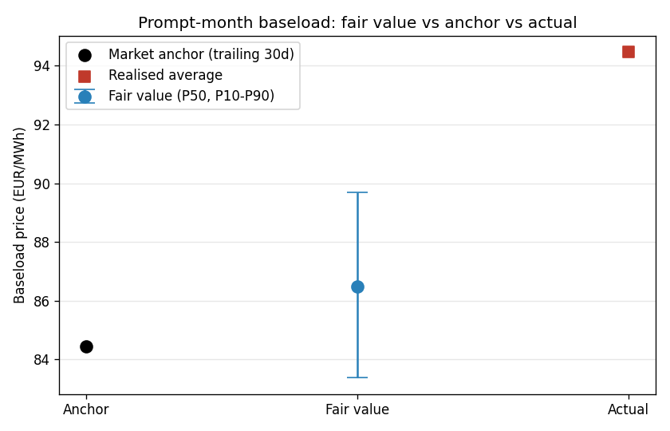

# Prompt-Curve Translation — DE-LU (prompt month)

Turns the Day-Ahead price forecast into a tradable curve view. Market anchor = trailing 30-day realised average (proxy for the prompt forward; swap in a live quote in production).

## 1. Delivery-period fair value (next month, baseload + peak)

- baseload_forecast: 77.65
- baseload_P10: 83.38
- baseload_P50: 86.47
- baseload_P90: 89.69
- peak_forecast: 55.39
- baseload_actual: 94.47
- peak_actual: 76.04

## 2. Level signal (baseload)

- anchor: 84.44
- fair_value_P50: 86.47
- edge_eur_mwh: 2.03
- band_halfwidth: 3.16
- z_score: 0.64
- direction: FLAT
- position_mw: 0.0
- note: edge within forecast band -> stand aside

## 3. Shape signal (peak vs base)

- fv_peak_base_spread: -22.26
- anchor_peak_base_spread: -20.19
- spread_edge_eur_mwh: -2.07
- direction: SHORT peak/base spread

## 4. Invalidation checks

- FAIL — Realised avg within P10-P90 band (actual 94.47 vs [83.38, 89.69])
- PASS — Renewable forecast drift <= 15% (realised vs forecast renewables drift +0.7%)

## What the desk does with this

- **Level (baseload):** a LONG signal means our fair value sits above the market
  anchor, i.e. the prompt looks cheap — express by buying the **prompt-month
  baseload** (size = `position_mw`, confidence-weighted). SHORT = sell it.
- **Shape (peak/base):** trade the **peak vs off-peak spread** when our forecast
  shape differs from the anchor's. In summer DE, midday solar can push peak below
  base — a structural shape view, separable from the level.
- **Scaling up the curve:** the same hourly model, aggregated over a quarter,
  gives a **prompt-quarter** view; differences between months drive **calendar
  spreads**.
- **Sizing:** position is proportional to the edge in units of forecast standard
  deviation (`z_score`), capped at the desk clip. Edges inside the forecast band
  are not traded.

## What invalidates the signal

1. **Band breach** — realised period average leaves the P10-P90 band: the model is
   mis-calibrated for the current regime; stand down and recalibrate.
2. **Fundamentals drift** — realised wind/solar diverge from the forecast the fair
   value was built on (> tolerance): the FV is stale; re-run with fresh forecasts.
3. **Edge within noise** — `|edge| < band half-width`: no tradable conviction.
4. **Regime shocks (manual gate)** — large gas/carbon moves change marginal cost
   and are not yet in the model; flag and re-assess before trading.

## Figure

- 