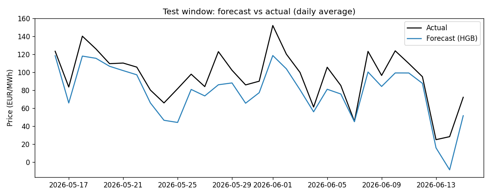
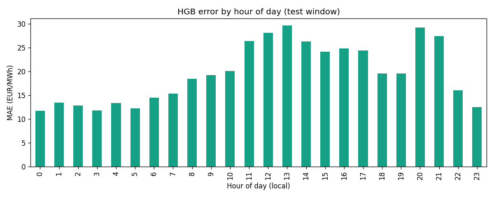

# Forecasting Report — Next-Day Day-Ahead Price (DE-LU)

Hourly DA price model. Features are leakage-free: wind+solar day-ahead forecasts, calendar, and already-known price lags.

## 1. Walk-forward cross-validation (mean over folds)

| model          |   MAE |   RMSE |   tail_MAE |
|:---------------|------:|-------:|-----------:|
| seasonal_naive | 35.36 |  52.8  |      74.04 |
| linear         | 19.44 |  28.74 |      39.09 |
| hgb            | 16.27 |  24.66 |      35.25 |

_6 expanding folds of 30 days each. Model is selected on CV (HGB), not on the test set._

## 2. Held-out test window (last 30 days, out-of-sample)

| model          |   MAE |   RMSE |   tail_MAE |
|:---------------|------:|-------:|-----------:|
| seasonal_naive | 31.5  |  46.19 |      54.92 |
| linear         | 18.72 |  27.71 |      34.2  |
| hgb            | 19.6  |  27.82 |      46.06 |

## 3. DA -> curve view (HGB forecast aggregated to blocks)

**Next week (7d):**
- baseload_forecast: 95.7
- baseload_actual: 107.75
- peak_forecast: 78.39
- peak_actual: 90.51
- baseload_P10: 97.82
- baseload_P50: 104.41
- baseload_P90: 110.96

**Next month (30d):**
- baseload_forecast: 77.65
- baseload_actual: 94.47
- peak_forecast: 55.39
- peak_actual: 76.04
- baseload_P10: 83.38
- baseload_P50: 86.47
- baseload_P90: 89.69

_Baseload P10/P50/P90 come from a block bootstrap of out-of-sample daily forecast errors (not test residuals)._

## 4. Figures

- 
- 