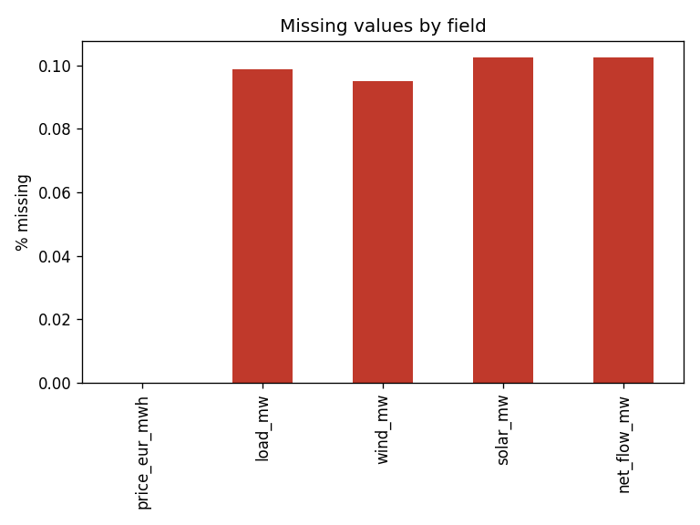
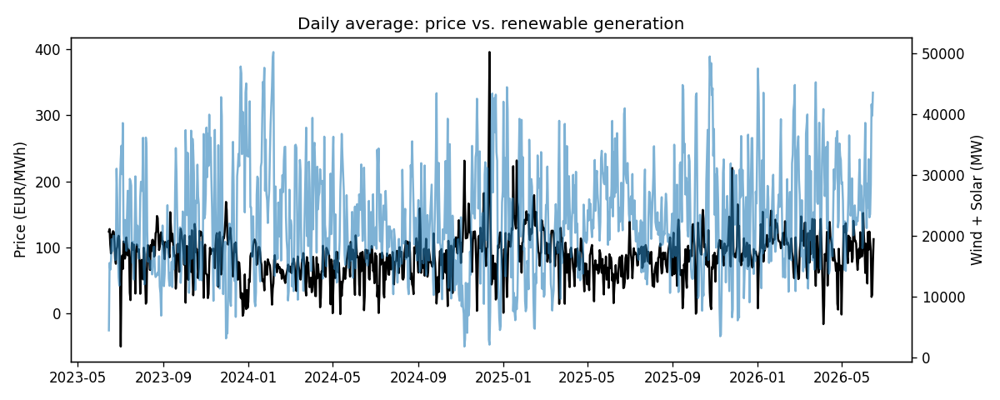

# Data Quality Report — German Power (DE-LU)

Source: Energy-Charts API (Fraunhofer ISE). Generated automatically by `src/qa.py`.

## 1. Coverage

- **first_timestamp_utc**: 2023-06-15 22:00:00+00:00
- **last_timestamp_utc**: 2026-06-16 21:00:00+00:00
- **rows_present**: 26328
- **hours_expected**: 26328
- **coverage_pct**: 100.0

## 2. Missingness by field

|               |   missing |   missing_pct |
|:--------------|----------:|--------------:|
| price_eur_mwh |         0 |          0    |
| load_mw       |        26 |          0.1  |
| wind_mw       |        25 |          0.09 |
| solar_mw      |        27 |          0.1  |
| net_flow_mw   |        27 |          0.1  |

## 3. Duplicates

- Duplicated timestamps: **0**

## 4. Outliers & sanity bounds

- **negative_prices**: 1537
- **price_above_500**: 17
- **price_min**: -500.0
- **price_max**: 936.28
- **negative_wind**: 0
- **negative_solar**: 0
- **load_min_mw**: 30903.0
- **load_max_mw**: 78241.0

## 5. Daylight-saving-time check

Days that are not 24 hours long (expected: 23h in spring, 25h in autumn each year):

| timestamp_local   |   hours_in_day |
|:------------------|---------------:|
| 2023-10-29        |             25 |
| 2024-03-31        |             23 |
| 2024-10-27        |             25 |
| 2025-03-30        |             23 |
| 2025-10-26        |             25 |
| 2026-03-29        |             23 |

## 6. Figures

- 
- 
